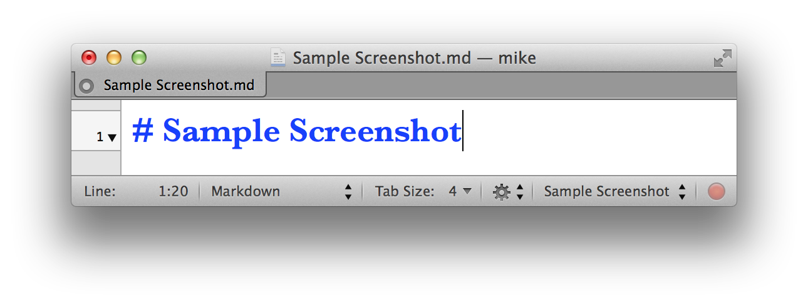

## Sample Chapter 1
ifdef::env-github[:outfilesuffix: .adoc]

### Sample section
Sample link: <<sample-diagram-id>>

Sample other-chapter section link: <<2-SampleChapter2#sample-section-2>>

Monospace: `monospace`

Italics: _italics_

Bold: **bold**

// Sample comment

1.  Sample numbered list
2.  Sample numbered list

Sample text.

* Sample bullet list
* Sample bullet list

#### Sample subsection
.Sample note title
NOTE: Sample note contents.

.Sample warning title
WARNING: Sample warning contents.

.Sample diagram title
[[sample-diagram-id]]


.Sample screenshot title
[[sample-screenshot-id]]


.Sample listing title
```
sample listing contents<1>
```
<1> callout

.Sample listing title with long callouts
[.long-annotations]
```
Sample listing contents with long callouts <1>
```
<1> sample long callout
